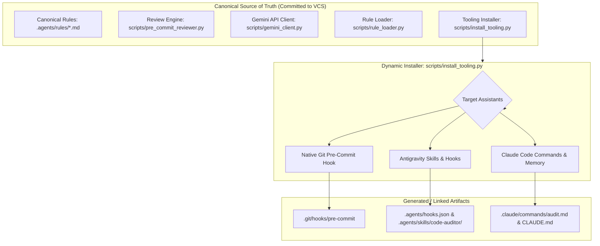
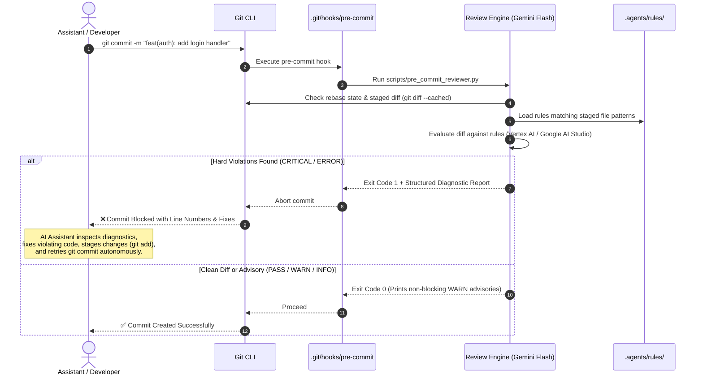

# Agentic Development Environment

[](https://www.python.org/)
[](https://deepmind.google/technologies/gemini/)
[](AGENTS.md)
[](LICENSE)

A vendor-neutral, portable **Agentic Development Environment** designed for seamless pair programming between human developers and AI coding assistants (Google Antigravity, Anthropic Claude Code, Cursor, and IDE tooling).

This repository provides:
1. **A Single Canonical Best-Practices Store** (`.agents/rules/`): Pure Markdown rules with YAML frontmatter.
2. **A Dynamic Multi-Assistant Installer** (`scripts/install_tooling.py`): Zero repository clutter; generates Git hooks, Antigravity skills/hooks, and Claude Code commands on demand.
3. **A Universal Pre-Commit Review Engine** (`scripts/pre_commit_reviewer.py` & `scripts/gemini_client.py`): Gemini 3.7 Flash powered diff evaluation supporting Google Application Default Credentials (ADC) and Google AI Studio, with SHA-256 diff caching and a two-tier severity gating policy.
4. **Autonomous Agent Self-Healing**: Hard violations (`ERROR` / `CRITICAL`) block commits and emit actionable structured diagnostics for hands-free remediation.
5. **Portable Standalone Distribution** (`scripts/package_tooling.py`): One-command packaging and extraction into any target repository.

---

## Architecture & Workflow

### 1. System Architecture



### 2. Pre-Commit Review & Hands-Free Self-Healing



---

## Directory Structure

```text
.
├── .agents/
│   ├── rules/                         # Canonical markdown best-practice rules
│   │   ├── README.md                  # Rule catalog and taxonomy
│   │   ├── 00_meta_guidelines.md      # Branch protection, PR standards, conventional commits
│   │   ├── 01_architecture.md         # Layer isolation, domain boundaries, typed contracts
│   │   ├── 02_security_and_secrets.md # Secret sanitization, zero hardcoded credentials
│   │   ├── 03_code_quality.md         # Strict typing, visible mock warnings, error handling
│   │   └── 04_testing_standards.md    # Test suite isolation, deterministic offline stubs
│   ├── skills/code-auditor/SKILL.md   # Dynamic Antigravity on-demand audit skill (generated)
│   ├── hooks.json                     # Dynamic Antigravity lifecycle hook config (generated)
│   └── audit.log                      # Local audit execution history
├── .claude/
│   └── commands/audit.md              # Dynamic Claude Code /audit slash command (generated)
├── dist/
│   └── dev-env-tooling.zip            # Standalone portable tooling distribution bundle
├── scripts/
│   ├── gemini_client.py               # Gemini 3.7 Flash review client (Vertex AI & Google AI Studio)
│   ├── install_tooling.py             # Dynamic assistant tooling & hook generator
│   ├── package_tooling.py             # Portable workspace bundler & extractor
│   ├── pre_commit_reviewer.py         # Universal pre-commit review CLI & gating engine
│   └── rule_loader.py                 # Markdown & YAML frontmatter rule parser
├── tests/
│   ├── unit/                          # Isolated unit tests for installer, loader, packager, reviewer
│   └── integration/                   # End-to-end Git hook lifecycle integration tests
├── .env.example                       # Environment configuration template
├── AGENTS.md                          # Human-Agent collaboration protocol & branch guidelines
└── README.md                          # Project documentation
```

---

## Quick Start Guide

### 1. Setting Up in This Repository

1. **Configure Google Cloud / Gemini Credentials**:
   - **Option A (Recommended: Google Cloud ADC)**:
     ```bash
     gcloud auth application-default login
     ```
   - **Option B (Google AI Studio API Key)**:
     ```bash
     cp .env.example .env
     # Edit .env and set GEMINI_API_KEY=your_key_here
     ```

2. **Install Assistant Tooling & Git Hooks**:
   ```bash
   python3 scripts/install_tooling.py --all
   ```
   This generates the native `.git/hooks/pre-commit`, Antigravity skills & hooks (`.agents/`), and Claude Code command (`.claude/commands/audit.md`).

3. **Stage Changes & Commit**:
   ```bash
   git add .
   git commit -m "feat(core): implement feature"
   ```
   The pre-commit hook automatically reviews staged files against canonical rules using Gemini 3.7 Flash.

---

### 2. Distributing into Another Repository

You can distribute and bootstrap this entire tooling environment into any target workspace:

```bash
# Option A: Extract and auto-install using package_tooling.py
python3 scripts/package_tooling.py --extract /path/to/target-workspace --install

# Option B: Use the pre-built portable zip
unzip dist/dev-env-tooling.zip -d /path/to/target-workspace
cd /path/to/target-workspace
python3 scripts/install_tooling.py --all
```

---

## Canonical Rule Catalog & Severity Policy

Rules are defined in [`.agents/rules/`](.agents/rules/) with YAML frontmatter specifying file match globs and default severities.

| Rule File | Title | Default Severity | Scope / Applies To |
| :--- | :--- | :--- | :--- |
| [`00_meta_guidelines.md`](.agents/rules/00_meta_guidelines.md) | VCS Workflow & Branch Protection | `CRITICAL` | `*` (All files & Git actions) |
| [`01_architecture.md`](.agents/rules/01_architecture.md) | Modular Architecture & Domain Boundaries | `WARN` | `**/*.py`, `**/*.ts`, `**/*.go`, `**/*.rs` |
| [`02_security_and_secrets.md`](.agents/rules/02_security_and_secrets.md) | Security Policy & Secret Sanitization | `CRITICAL` | `*` (All files) |
| [`03_code_quality.md`](.agents/rules/03_code_quality.md) | Code Quality, Typing & Mock Transparency | `WARN` | `**/*.py`, `**/*.ts`, `**/*.go` |
| [`04_testing_standards.md`](.agents/rules/04_testing_standards.md) | Isolated & Deterministic Testing | `WARN` | `tests/**`, `**/*test*` |

### Two-Tier Severity Gating Policy

| Severity | Hook Behavior | Description |
| :--- | :--- | :--- |
| **`CRITICAL`** / **`ERROR`** | **Exit 1 (Blocks Commit)** | Severe violations such as hardcoded API keys, direct commits to `main`, untyped public contracts, or silent mocks outside test harnesses. Provides structured diffs for automated agent self-healing. |
| **`WARN`** | **Exit 0 (Commit Allowed)** | Broad architectural advisories or style recommendations. Displayed prominently in the terminal for developer awareness without impeding rapid WIP commits. |
| **`INFO`** | **Exit 0 (Commit Allowed)** | Informational tips, documentation hints, and non-blocking guidance. |

---

## Operational Resilience & Offline Graceful Degradation

The review engine incorporates robust safeguards to prevent workflow friction:

1. **5-Second / 30-Second API Timeouts**: Network calls fail fast to prevent hanging git operations.
2. **Offline Degradation**: If Google ADC credentials or API keys are missing, or if the network is unreachable, the reviewer logs a prominent notice, executes local deterministic static checks (`ruff check`), and exits `0` without blocking work.
3. **Interactive Rebase & Cherry-Pick Detection**: Automatically skips LLM calls during `git rebase` or `git cherry-pick` (`GIT_REFLOG_ACTION`).
4. **Instant Bypass**: Set `SKIP_LLM_HOOK=1` to temporarily bypass review when necessary.
5. **Local SHA-256 Diff Caching**: Cached under `.git/.llm_cache` to eliminate duplicate LLM evaluations for identical staged diffs.
6. **Audit History**: All review decisions (passed, blocked, degraded, skipped) are recorded in `.agents/audit.log`.

---

## CLI Command Reference

### `scripts/install_tooling.py`
Dynamically registers or cleans assistant hooks and configurations.
```bash
python3 scripts/install_tooling.py --all          # Install Git pre-commit, Antigravity, and Claude tooling
python3 scripts/install_tooling.py --git-hook    # Install only the native Git pre-commit hook
python3 scripts/install_tooling.py --antigravity # Install only Antigravity skills & hooks
python3 scripts/install_tooling.py --claude      # Install only Claude Code command & memory pointer
python3 scripts/install_tooling.py --clean       # Remove all generated assistant artifacts
```

### `scripts/pre_commit_reviewer.py`
Executes pre-commit review against staged changes.
```bash
python3 scripts/pre_commit_reviewer.py                       # Run review against staged changes
python3 scripts/pre_commit_reviewer.py --skip-llm           # Bypass LLM evaluation
python3 scripts/pre_commit_reviewer.py --backend google_ai  # Use Google AI Studio backend
python3 scripts/pre_commit_reviewer.py --model gemini-3.7-flash
```

### `scripts/package_tooling.py`
Packages and extracts the portable tooling distribution bundle.
```bash
python3 scripts/package_tooling.py                               # Create dist/dev-env-tooling.zip
python3 scripts/package_tooling.py --list dist/dev-env-tooling.zip # Inspect zip bundle contents
python3 scripts/package_tooling.py --extract /path/to/target --install # Extract & auto-install
```

---

## Testing & Quality Assurance

Run the comprehensive unit and integration test suite:

```bash
# Run all unit and integration tests
python3 -m unittest discover tests
```

---

## Human-Agent Collaboration & Branching Protocol

This repository follows strict collaboration rules defined in [**AGENTS.md**](AGENTS.md):

- **Strict Main Branch Protection**: Never commit or push directly to `main`. All changes must go through dedicated feature/fix branches and PRs.
- **Branch Naming**: `feature/<name>`, `fix/<name>`, `docs/<name>`, `refactor/<name>`, `chore/<name>`, `test/<name>`.
- **Conventional Commits**: `<type>(<scope>): <summary>` (e.g., `docs(repo): add project-level README`).
- **Autonomous Resolution**: Low-impact bug fixes and type repairs are resolved autonomously; significant functional/architectural changes require explicit user approval.
