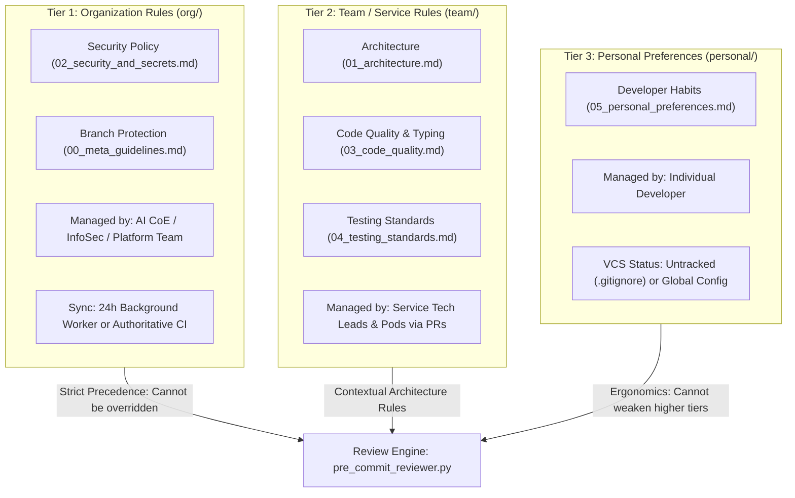

# Agentic Development Environment

[](https://www.python.org/)
[](https://deepmind.google/technologies/gemini/)
[](AGENTS.md)
[](LICENSE)

A vendor-neutral, portable **Agentic Development Environment** designed for seamless pair programming and governed collaboration between human developers and AI coding assistants (Google Antigravity, Anthropic Claude Code, Cursor, and IDE tooling).

This repository provides:
1. **Multi-Tier Rules Governance Hierarchy** (`.agents/rules/org/`, `.agents/rules/team/`, `.agents/rules/personal/`): Distinct rule lifecycles separating enterprise guardrails, service architecture standards, and personal developer preferences.
2. **24-Hour Non-Blocking Background Org Rule Sync** (`scripts/sync_org_rules.py`): Automatically checks and updates enterprise rules in a detached background worker without delaying developers' pre-commit workflows.
3. **Dynamic Multi-Assistant Tooling & Skills** (`scripts/install_tooling.py`): Zero repository clutter; generates Git hooks, Antigravity skills/hooks, and Claude Code commands on demand.
4. **VCS-Isolated Personal Preference Persistence** (`scripts/preference_manager.py` & `.agents/rules/personal/`): Captures developer habits into persistent rules without polluting git diffs or creating repository merge conflicts.
5. **Universal Pre-Commit Review Engine** (`scripts/pre_commit_reviewer.py` & `scripts/gemini_client.py`): Gemini 3.7 Flash powered diff evaluation supporting Google Application Default Credentials (ADC) and Google AI Studio, with SHA-256 diff caching and a non-weakening multi-tier gating policy.
6. **Authoritative CI Gatekeeper** (`.github/workflows/ai_rules_audit.yml`): "Two-Grip" governance model providing local pre-commit assistance paired with mandatory remote CI compliance.
7. **Portable Standalone Distribution** (`scripts/package_tooling.py`): One-command packaging and extraction into any target repository.

---

## Architecture & Governance Workflow

### 1. Multi-Tier Governance Architecture

Rules are partitioned into three distinct lifecycles to prevent cross-contamination, rule drift, and VCS merge conflicts:



### 2. The 24-Hour Non-Blocking Org Rule Sync & Review Cycle

```mermaid
sequenceDiagram
    autonumber
    actor DevOrAgent as Assistant / Developer
    participant Git as Git CLI
    participant Hook as .git/hooks/pre-commit
    participant Reviewer as pre_commit_reviewer.py
    participant Worker as sync_org_rules.py (Detached)
    participant Engine as Gemini 3.7 Flash Engine
    participant Central as Central Rules Endpoint / Org Repo

    DevOrAgent->>Git: git commit -m "feat(auth): add login handler"
    Git->>Hook: Execute pre-commit hook
    Hook->>Reviewer: Run review check
    Reviewer->>Reviewer: Check .agents/rules/org/.sync_timestamp

    alt Timestamp > 24 Hours (or Missing)
        Reviewer-)Worker: Spawn detached background process (0ms delay)
        Note over Worker: Runs asynchronously in background:<br/>Fetches latest org rules from Central<br/>Validates & atomically writes cache<br/>Updates .sync_timestamp
    else Timestamp < 24 Hours
        Note over Reviewer: Cache fresh; no background sync needed
    end

    Reviewer->>Engine: Immediately review staged diff against cached rules (Org > Team > Personal)
    alt Critical / Error Violations Detected
        Engine-->>Hook: Exit Code 1 + Structured Diagnostic Report
        Hook-->>Git: Block commit
        Git-->>DevOrAgent: ❌ Commit Blocked with remediation instructions
    else Clean Diff or Advisory
        Engine-->>Hook: Exit Code 0 (WARN advisories printed)
        Hook-->>Git: Commit allowed
        Git-->>DevOrAgent: ✅ Commit Created Successfully
    end
```

---

## Rule Tiers & Precedence Rules

| Tier | Directory | Owner & Lifecycle | Version Control (VCS) | Precedence |
| :--- | :--- | :--- | :--- | :--- |
| **Tier 1: Organization** | [`.agents/rules/org/`](.agents/rules/org/) | AI CoE / InfoSec / Platform Engineering | Read-only mirror in project repo. | **Highest ($\text{Org} \succ \text{Team} \succ \text{Personal}$)** |
| **Tier 2: Team** | [`.agents/rules/team/`](.agents/rules/team/) | Service Pods & Domain Tech Leads | Committed and tracked via PRs. | **Middle** |
| **Tier 3: Personal** | [`.agents/rules/personal/`](.agents/rules/personal/) | Individual Developer | **Untracked (`.gitignore`)** or `~/.gemini/config/rules/`. | **Lowest** |

### The Non-Weakening Rule of Precedence
Lower tiers can specialize or add constraints, but **cannot weaken or silence** constraints defined in a higher tier. For example, a personal preference or team rule cannot downgrade an organizational `CRITICAL` or `ERROR` rule to `WARN` or `INFO`.

---

## Directory Structure

```text
.
├── .agents/
│   ├── rules/                         # Canonical markdown best-practice rules
│   │   ├── README.md                  # Multi-tier rule catalog & taxonomy
│   │   ├── org/                       # Tier 1: Organization-wide enterprise rules
│   │   │   ├── 00_meta_guidelines.md  # Branch protection, PR standards, conventional commits
│   │   │   ├── 02_security_and_secrets.md # Secret sanitization, zero hardcoded credentials
│   │   │   └── .sync_timestamp        # Local TTL timestamp (untracked)
│   │   ├── team/                      # Tier 2: Team / domain architecture rules
│   │   │   ├── 01_architecture.md     # Layer isolation, domain boundaries, typed contracts
│   │   │   ├── 03_code_quality.md     # Strict typing, visible mock warnings, error handling
│   │   │   └── 04_testing_standards.md # Test suite isolation, deterministic offline stubs
│   │   └── personal/                  # Tier 3: Developer workflow preferences (untracked)
│   │       ├── .gitkeep               # Preserves directory in git
│   │       └── 05_personal_preferences.md # Individual workflow preferences
│   ├── skills/                        # Dynamic Antigravity on-demand skills (generated)
│   │   ├── code-auditor/SKILL.md      # On-demand pre-commit diff audit skill
│   │   └── personal-preferences/SKILL.md # Workflow preference capture & rule persistence skill
│   ├── hooks.json                     # Dynamic Antigravity lifecycle hook config (generated)
│   └── audit.log                      # Local audit and sync execution history
├── .claude/
│   └── commands/                      # Dynamic Claude Code slash commands (generated)
│       ├── audit.md                   # /audit command
│       └── preferences.md             # /preferences command
├── .github/
│   └── workflows/
│       └── ai_rules_audit.yml         # Authoritative CI server-side compliance gate
├── dist/
│   └── dev-env-tooling.zip            # Standalone portable tooling distribution bundle
├── scripts/
│   ├── gemini_client.py               # Gemini 3.7 Flash review client (Vertex AI & Google AI Studio)
│   ├── install_tooling.py             # Dynamic assistant tooling & hook generator
│   ├── package_tooling.py             # Portable workspace bundler & extractor
│   ├── pre_commit_reviewer.py         # Universal pre-commit review CLI & gating engine
│   ├── preference_manager.py          # Preference inspector, updater, and rule formatter
│   ├── rule_loader.py                 # Multi-tier rule loader & precedence resolver
│   └── sync_org_rules.py              # 24-hour background organizational rule synchronizer
├── tests/
│   ├── unit/                          # Isolated unit tests for installer, loader, packager, reviewer, sync
│   └── integration/                   # End-to-end Git hook lifecycle integration tests
├── .env.example                       # Environment configuration template
├── AGENTS.md                          # Human-Agent collaboration protocol & branch guidelines
├── pyproject.toml                     # Project dependencies and lint configuration
└── README.md                          # Project documentation
```

---

## Quick Start Guide

### 1. Setting Up in This Repository

1. **Configure Google Cloud / Gemini Credentials**:
   - **Option A (Recommended: Google Cloud ADC)**:
     ```bash
     gcloud auth application-default login
     ```
   - **Option B (Google AI Studio API Key)**:
     ```bash
     cp .env.example .env
     # Edit .env and set GEMINI_API_KEY=your_key_here
     ```

2. **Install Assistant Tooling & Git Hooks**:
   ```bash
   python3 scripts/install_tooling.py --all
   ```
   This generates the native `.git/hooks/pre-commit`, Antigravity skills & hooks (`.agents/`), and Claude Code command (`.claude/commands/audit.md`).

3. **Stage Changes & Commit**:
   ```bash
   git add .
   git commit -m "feat(core): implement feature"
   ```
   The pre-commit hook automatically checks organizational rule freshness, loads rules across all tiers, and reviews staged diffs using Gemini 3.7 Flash.

---

### 2. Distributing into Another Repository

You can distribute and bootstrap this entire tooling environment into any target workspace:

```bash
# Option A: Extract and auto-install using package_tooling.py
python3 scripts/package_tooling.py --extract /path/to/target-workspace --install

# Option B: Use the pre-built portable zip
unzip dist/dev-env-tooling.zip -d /path/to/target-workspace
cd /path/to/target-workspace
python3 scripts/install_tooling.py --all
```

---

## Two-Tier Severity Gating Policy

| Severity | Hook Behavior | Description |
| :--- | :--- | :--- |
| **`CRITICAL`** / **`ERROR`** | **Exit 1 (Blocks Commit)** | Severe violations such as hardcoded API keys, direct commits to `main`, untyped public contracts, or silent mocks outside test harnesses. Provides structured diffs for automated agent self-healing. |
| **`WARN`** | **Exit 0 (Commit Allowed)** | Broad architectural advisories or style recommendations. Displayed prominently in the terminal for developer awareness without impeding rapid WIP commits. |
| **`INFO`** | **Exit 0 (Commit Allowed)** | Informational tips, documentation hints, and non-blocking guidance. |

---

## Operational Resilience & Offline Graceful Degradation

The review engine incorporates robust safeguards to prevent workflow friction:

1. **24-Hour Background Sync**: Checks and refreshes organizational rules asynchronously in a detached process with zero added latency to developers' commits.
2. **Offline Resilience**: If the network is unreachable or credentials are missing, organizational rules fall back to the existing local cache, and reviews degrade gracefully to local static checks (`ruff check`).
3. **Interactive Rebase & Cherry-Pick Detection**: Automatically skips LLM calls during `git rebase` or `git cherry-pick` (`GIT_REFLOG_ACTION`).
4. **Instant Bypass**: Set `SKIP_LLM_HOOK=1` to temporarily bypass review when necessary.
5. **Local SHA-256 Diff Caching**: Cached under `.git/.llm_cache` to eliminate duplicate LLM evaluations for identical staged diffs.
6. **Audit History**: All review decisions and sync operations are recorded in `.agents/audit.log`.

---

## CLI Command Reference

### `scripts/sync_org_rules.py`
Synchronizes central organizational rules into `.agents/rules/org/`.
```bash
python3 scripts/sync_org_rules.py                     # Sync rules if older than 24h
python3 scripts/sync_org_rules.py --check-only        # Check if rules are stale (exit code 1 if stale)
python3 scripts/sync_org_rules.py --force             # Force immediate synchronization
python3 scripts/sync_org_rules.py --background        # Run in a detached background worker
python3 scripts/sync_org_rules.py --source-url <URL>  # Sync from remote release bundle
```

### `scripts/pre_commit_reviewer.py`
Executes pre-commit review against staged changes across all tiers.
```bash
python3 scripts/pre_commit_reviewer.py                       # Run review against staged changes
python3 scripts/pre_commit_reviewer.py --skip-llm           # Bypass LLM evaluation
python3 scripts/pre_commit_reviewer.py --backend google_ai  # Use Google AI Studio backend
python3 scripts/pre_commit_reviewer.py --model gemini-3.7-flash
```

### `scripts/preference_manager.py`
Inspects, adds, or removes custom developer preferences in `.agents/rules/personal/05_personal_preferences.md`.
```bash
python3 scripts/preference_manager.py --list                         # List all recorded preferences
python3 scripts/preference_manager.py --add "Always use strict typing" --section "2. Code Style & Engineering Conventions"
python3 scripts/preference_manager.py --remove "strict typing"       # Remove matching preference
```

### `scripts/package_tooling.py`
Packages and extracts the portable tooling distribution bundle (excluding personal preferences and sync timestamps).
```bash
python3 scripts/package_tooling.py                               # Create dist/dev-env-tooling.zip
python3 scripts/package_tooling.py --list dist/dev-env-tooling.zip # Inspect zip bundle contents
python3 scripts/package_tooling.py --extract /path/to/target --install # Extract & auto-install
```

### `scripts/install_tooling.py`
Dynamically registers or cleans assistant hooks and configurations.
```bash
python3 scripts/install_tooling.py --all          # Install Git pre-commit, Antigravity, AGENTS pointer, and Claude tooling
python3 scripts/install_tooling.py --git-hook    # Install only the native Git pre-commit hook
python3 scripts/install_tooling.py --antigravity # Install only Antigravity skills & hooks
python3 scripts/install_tooling.py --agents      # Ensure AGENTS.md rules pointer
python3 scripts/install_tooling.py --claude      # Install Claude Code commands (and memory pointer if CLAUDE.md exists)
python3 scripts/install_tooling.py -y            # Automatically accept insert-only pointer injection prompts
python3 scripts/install_tooling.py --clean       # Remove all generated assistant artifacts
```

---

## Testing & Quality Assurance

Run the comprehensive unit and integration test suite:

```bash
# Run all unit and integration tests with pytest
uv run pytest

# Run linter checks with ruff
uv run ruff check .
```

---

## Human-Agent Collaboration & Branching Protocol

This repository follows strict collaboration rules defined in [**AGENTS.md**](AGENTS.md):

- **Strict Main Branch Protection**: Never commit or push directly to `main`. All changes must go through dedicated feature/fix branches and PRs.
- **Branch Naming**: `feature/<name>`, `fix/<name>`, `docs/<name>`, `refactor/<name>`, `chore/<name>`, `test/<name>`.
- **Conventional Commits**: `<type>(<scope>): <summary>` (e.g., `feat(governance): implement 3-tier rules hierarchy and 24h background sync`).
- **Autonomous Resolution**: Low-impact bug fixes and type repairs are resolved autonomously; significant functional/architectural changes require explicit user approval.
