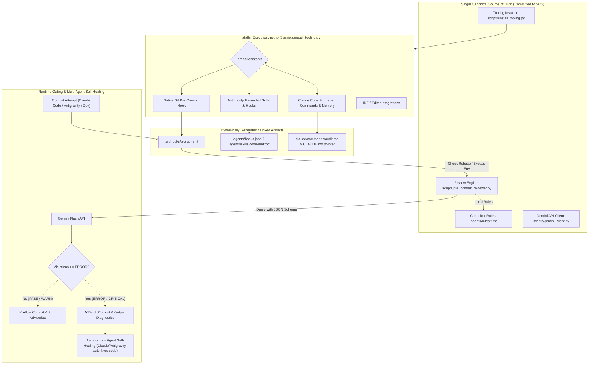
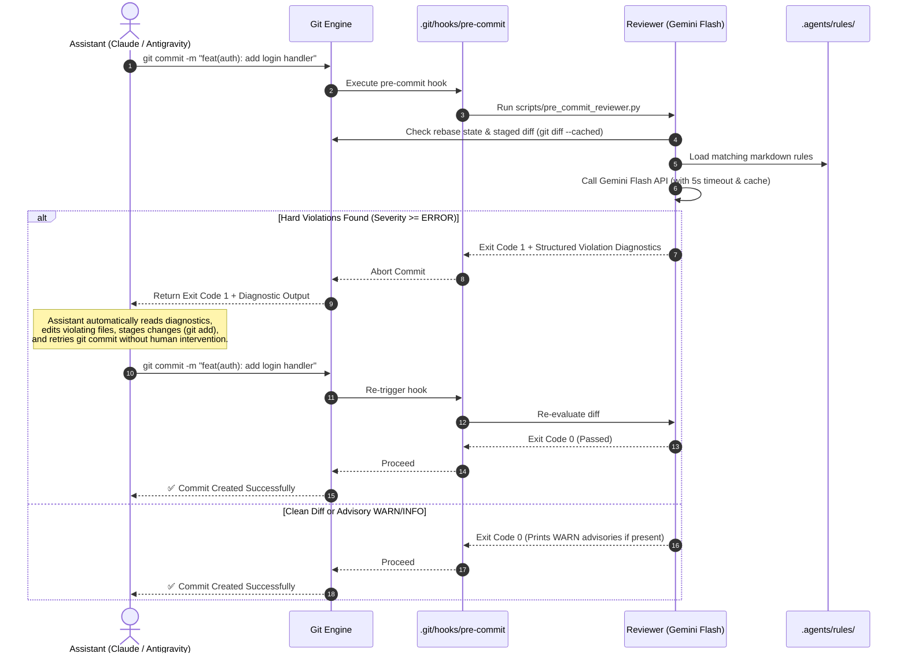

# Automated Pre-Commit LLM Best-Practices Review: Dynamic Multi-Assistant Architecture & Detailed Design

## 1. Executive Summary & Design Philosophy

Rather than polluting the repository with separate, redundant configuration files and hardcoded artifacts for each AI assistant (e.g., Claude Code, Antigravity, Cursor, Windsurf), this design establishes:

1. **A Single Canonical Best-Practices Store**: A vendor-neutral, pure Markdown knowledge base stored in `.agents/rules/` (or `guidelines/`).
2. **A Universal Core Review Engine**: A fast, deterministic Python review engine driven by the **Gemini Flash API** with strict JSON schema evaluation and local diff caching.
3. **A Dynamic Assistant Tooling Installer (`scripts/install_tooling.py` / `scripts/install_hooks.sh`)**: A single script that dynamically generates and registers assistant-specific hooks, skills, and memory files on-demand without manual repository clutter.
4. **Universal Pre-Commit Gating with Autonomous Self-Healing & Two-Tier Policy**: Git's native pre-commit hook automatically triggers on any commit attempt. Hard violations with severity **`ERROR`** or **`CRITICAL`** (e.g., exposed secrets, broken contracts) block the commit with actionable diagnostics for hands-free self-healing. Advisory items (**`WARN`**) surface prominent diagnostics without blocking fast local iteration, while full deep audits remain available on-demand or in CI/PR gates.



---

## 2. Dynamic Assistant Tooling Generator Architecture

To avoid maintaining separate manual artifacts across different coding assistants, the repository tracks only the **installer engine** and the **canonical rules**. The installer (`scripts/install_tooling.py`) is responsible for generating tool-specific configurations.

### Supported Assistant Targets & Generated Artifacts

| Assistant / Target | Generated Artifact | Role & Mechanics |
| :--- | :--- | :--- |
| **Git Core** | `.git/hooks/pre-commit` | Universal gate executing `python3 scripts/pre_commit_reviewer.py`. Runs on every commit regardless of tool or IDE. |
| **Antigravity** | `.agents/hooks.json`<br>`.agents/skills/code-auditor/SKILL.md` | Intercepts agent command lifecycle and provides progressive disclosure skill referencing canonical `.agents/rules/*.md`. |
| **Claude Code** | `CLAUDE.md` (pointer block)<br>`.claude/commands/audit.md` | Ingests project memory pointing to `.agents/rules/` and registers the on-demand `/audit` slash command. |
| **Cursor / VS Code** | `.vscode/tasks.json` (optional) | Provides one-click task to audit current diff against rules. |

### Command-Line Interface (`scripts/install_tooling.py`)
```bash
# Install for all supported assistants and git hooks
python3 scripts/install_tooling.py --all

# Install for specific assistants only
python3 scripts/install_tooling.py --git-hook --claude --antigravity

# Clean / uninstall generated assistant artifacts
python3 scripts/install_tooling.py --clean
```

---

## 3. Canonical Best-Practices Store Specification

The canonical rules live in a single repository location: `.agents/rules/`. They are written in clean Markdown with standardized YAML frontmatter for programmatic rule filtering.

### Directory Structure (Committed to VCS)
```text
.agents/rules/
├── README.md                      # Rule catalog index & domain taxonomy
├── 00_meta_guidelines.md          # Branch protection, PR standards, conventional commits
├── 01_architecture.md             # Layer isolation, domain boundaries, contract-first APIs
├── 02_security_and_secrets.md     # Secret sanitization, zero hardcoded credentials
├── 03_code_quality.md             # Strict typing, visible mock warnings, error handling
└── 04_testing_standards.md        # Test suite isolation, deterministic offline stubs
```

### Frontmatter Schema
```yaml
---
id: rule-architecture
title: Modular Architecture & Domain Boundaries
severity_default: WARN
applies_to:
  - "**/*.py"
  - "**/*.ts"
  - "**/*.go"
tags:
  - architecture
  - contracts
---
```

---

## 4. Gemini Flash API Review Engine Design

### Engine Components (`scripts/`)
1. `scripts/rule_loader.py`:
   - Scans `.agents/rules/*.md`.
   - Parses YAML frontmatter and extracts rules matching the file extensions and paths in the staged diff.
2. `scripts/gemini_client.py`:
   - Lightweight, zero-extra-dependency client for Gemini Flash API (`gemini-3.7-flash`).
   - Implements strict JSON schema validation.
   - Implements local SHA-256 diff caching (`.git/.llm_cache`) to avoid redundant API calls if staged files haven't changed.
3. `scripts/pre_commit_reviewer.py`:
   - CLI entrypoint invoked by the pre-commit hook.
   - **Environment & Rebase Detection**:
     - Automatically skips or fast-tracks review if `SKIP_LLM_HOOK=1` is set or if Git is in an interactive rebase / cherry-pick (`GIT_REFLOG_ACTION` contains `rebase` / `cherry-pick`).
   - **Offline & Graceful Degradation**:
     - Enforces a 5-second API request timeout.
     - If `GEMINI_API_KEY` is missing or the network is unreachable, it logs a prominent warning (`[WARNING: LLM Review skipped - network offline or GEMINI_API_KEY unset]`), runs deterministic local static checks (e.g., `ruff check`), and exits 0 to avoid blocking developer commits offline.
   - Extracts staged diffs (`git diff --cached --unified=3`).
   - Evaluates compliance against active rules.
   - **Two-Tier Gating Policy**:
     - **`CRITICAL` / `ERROR`** ➡️ **EXIT 1** (Commit blocked, e.g., plaintext secrets, broken contract schemas, direct main branch violations).
     - **`WARN`** ➡️ **EXIT 0** (Commit allowed, prominent advisory diagnostics rendered in terminal for immediate awareness without blocking WIP commits).
     - **`INFO` / `PASS`** ➡️ **EXIT 0** (Commit allowed).
   - Formats rich terminal and stderr output with file paths, line numbers, and actionable remediation diffs.

### JSON Output Schema Contract
```json
{
  "type": "OBJECT",
  "properties": {
    "passed": { "type": "BOOLEAN" },
    "summary": { "type": "STRING" },
    "violations": {
      "type": "ARRAY",
      "items": {
        "type": "OBJECT",
        "properties": {
          "file": { "type": "STRING" },
          "line_number": { "type": "INTEGER" },
          "rule_id": { "type": "STRING" },
          "rule_title": { "type": "STRING" },
          "severity": { "type": "STRING", "enum": ["INFO", "WARN", "ERROR", "CRITICAL"] },
          "issue": { "type": "STRING" },
          "suggested_fix": { "type": "STRING" },
          "suggested_code_diff": { "type": "STRING" }
        },
        "required": ["file", "rule_title", "severity", "issue", "suggested_fix"]
      }
    }
  },
  "required": ["passed", "summary", "violations"]
}
```

---

## 5. Multi-Assistant Hands-Free Self-Healing Workflow



---

## 6. End-to-End Implementation Blueprint

| Component | Path | Source Type | Description |
| :--- | :--- | :--- | :--- |
| **Rule Base** | `.agents/rules/00_meta_guidelines.md` | Committed | Branch policies, PR guidelines, conventional commits |
| **Rule Base** | `.agents/rules/01_architecture.md` | Committed | Modularity, API contract definitions, layer boundaries |
| **Rule Base** | `.agents/rules/02_security_and_secrets.md` | Committed | Zero hardcoded credentials, secret sanitization |
| **Rule Base** | `.agents/rules/03_code_quality.md` | Committed | Typing standards, mock transparency, error boundaries |
| **Rule Base** | `.agents/rules/04_testing_standards.md` | Committed | Unit/integration test isolation, deterministic stubs |
| **Rule Loader** | `scripts/rule_loader.py` | Committed | Parses frontmatter, dynamically matches rules to diff files |
| **API Client** | `scripts/gemini_client.py` | Committed | Gemini Flash API caller with JSON schema & SHA-256 cache |
| **Reviewer Engine** | `scripts/pre_commit_reviewer.py` | Committed | Gating engine and formatted diagnostic output generator |
| **Dynamic Installer**| `scripts/install_tooling.py` | Committed | Generates assistant-specific skills/hooks/commands dynamically |
| **Git Hook** | `.git/hooks/pre-commit` | Generated | Pre-commit hook executing reviewer engine |
| **Antigravity Hook** | `.agents/hooks.json` | Generated | Antigravity PreToolUse hook configuration |
| **Antigravity Skill**| `.agents/skills/code-auditor/SKILL.md`| Generated | Antigravity on-demand audit skill |
| **Claude Command** | `.claude/commands/audit.md` | Generated | Claude Code on-demand `/audit` command |
| **Claude Memory** | `CLAUDE.md` (pointer block) | Generated/Linked | Points Claude Code session context to `.agents/rules/` |

---

## 7. Verification & Validation Plan

### 1. Automated Tests
* **`tests/unit/test_install_tooling.py`**:
  - Test `--all`, `--clean`, and individual assistant flags.
  - Verify that generated hooks and skill formats are valid JSON/Markdown.
* **`tests/unit/test_rule_loader.py`**:
  - Test YAML frontmatter parsing and path glob matching (`**/*.py`, `**/*.ts`).
* **`tests/unit/test_pre_commit_reviewer.py`**:
  - Test pass (exit 0), `WARN` advisory pass (exit 0 with warnings), `ERROR` fail (exit 1), `CRITICAL` fail (exit 1).
  - Test offline degradation fallback when `GEMINI_API_KEY` is unset or network times out (exit 0 with warning).
  - Test rebase / cherry-pick detection and `SKIP_LLM_HOOK=1` environment bypass.
* **`tests/integration/test_git_hook_lifecycle.py`**:
  - Test commit lifecycle in a temporary Git repository with staged violations.

### 2. Multi-Assistant Verification
* Run `python3 scripts/install_tooling.py --all`.
* Verify Antigravity detects the generated skill and lifecycle hook.
* Verify Claude Code recognizes `CLAUDE.md` rules and `/audit` slash command.
* Test committing a violation via terminal/IDE GUI -> verify commit is blocked with formatted report.
* Test committing clean code -> verify commit completes automatically.

---

## 8. Trade-Off Mitigations & Operational Resilience

To balance automated best-practice enforcement against developer ergonomics and commit latency, the following resilience controls are baked into the architecture:

| Challenge / Trade-Off | Mitigation Strategy | Implementation Details |
| :--- | :--- | :--- |
| **False Positives & Subjective Blockers** | **Two-Tier Gating Policy** | Local pre-commit blocks **only** on hard `ERROR` / `CRITICAL` violations (e.g., secrets, broken API schemas). Broad architectural `WARN` items render non-blocking advisories locally, reserving strict gating for PR/CI reviews and on-demand `/audit`. |
| **Commit Latency & Offline Inoperability** | **Graceful Degradation & Timeout** | 5-second API timeout limit. If offline or `GEMINI_API_KEY` is unset, the reviewer logs a prominent warning and falls back to deterministic local checks (`ruff check`) without failing the commit. |
| **Git Workflow Friction (Rebases & WIP Commits)** | **Interactive Rebase Detection & Env Bypass** | Detects active rebase/cherry-pick operations via `GIT_REFLOG_ACTION` to avoid replaying slow LLM calls on every intermediate commit. Supports instant bypass via `SKIP_LLM_HOOK=1`. |
| **Redundant Token Consumption** | **Local SHA-256 Diff Caching** | Computes SHA-256 hashes of staged diffs (`.git/.llm_cache`). If an identical diff was already reviewed and passed, skips LLM API calls completely. |

